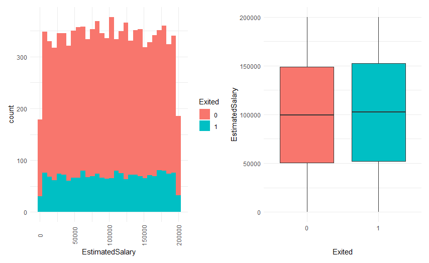
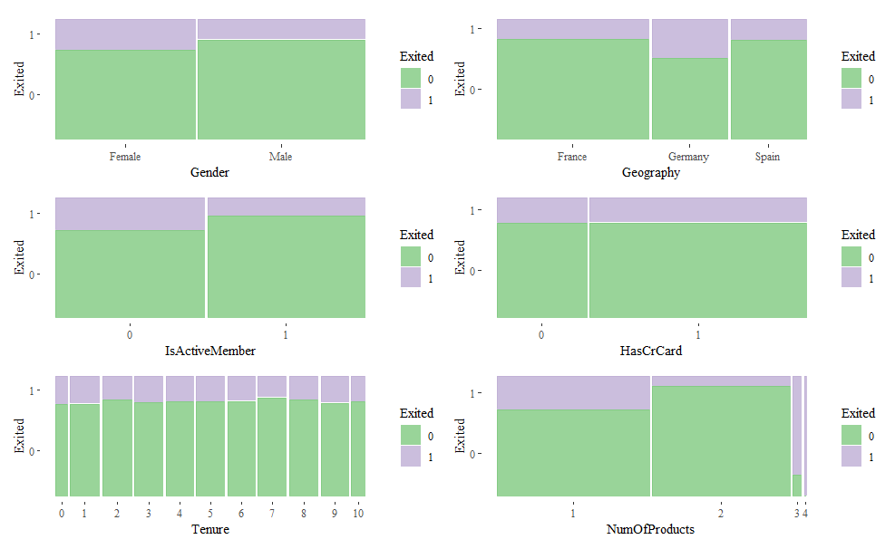
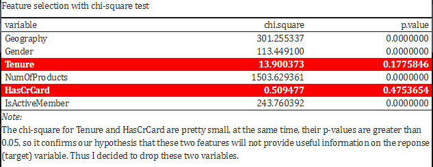

# Custumer-Churn
Customer Churn Analysis in R: Logistic, Classification Tree, XGBoost, Random Forest.

# Content:
1. Preprocessing & Data cleaning
2. Exploratory Data Analysis (EDA)
3. Feature selection & Chi-square Test
4. Predictive Models: Logistic, Classification Tree, XGBoost, Random Forest
5. Compare Models’ Performance
6. Feature Importance

# Code:
https://github.com/trajceskijovan/Custumer-Churn/blob/main/Customer%20Churn%20Analysis.R

# Context:
This analysis focuses on the behavior of bank customers who are more likely to leave the bank (i.e. close their bank account). 
The goal here is to identify the behavior of customers through Exploratory Data Analysis and later on use predictive analytics techniques to determine the customers who are most likely to churn (leave).

# EDA

    - CreditScore: from 350 to 850
    - Geography:France, Germany and Spain
    - Age: from 18 to 92
    - Tenure: how long customer has stayed with the bank
    - Balance: the amount of money available for withdrawal
    - NumOfProducts: number of products customers use in the bank
    - IsActiveMember: 0,1 -> Inactive, Active
    - EstimatedSalary: customer’s annual salary
    - Exited: whether the customer has churned (closed the bank account) where 0,1 -> Stay, Churn

# No NA`s:

# Target [ Stay (0), Churn/Leave(1) ]:

# Distribution - Continuous Variables:

1. Age is a bit right-skewed
2. Balance is fairly normal distributed
3. Most credit scores are above 600, it is possible that high quality customers will churn

# Correlation Matrix

1. No high correlation between the continuous variables (i.e. no multicollinearity)
2. We will keep all of the continuous variables

# Distribution - Categorical Variables:

1. More male customers than females
2. Customers are mostly from France
3. Most customers have the bank’s credit card
4. Almost equal number of active and non-active members, not a very good sign
5. Most customers use one or two kind of products, with a very few use three or four products
6. Almost equal number of customers in different tenure groups, except 0 and 10.

# Variables Deep Dive:

# AGE

1. Non-churned customers have a right-skewed distribution (tend to be young)
2. Outliers above 60 years old - perhaps our stable customers
3. Churned customers are mostly around 40 to 50. They might need to switch to other banking service for retirement purpose or whole family
4. We cab see very clear difference between these two groups

# BALANCE

1. Distribution of these two groups is similar
2. Surprisingly some non-churned customers have lower balance than churned customers

# CREDIT SCORE

1. Similar distribution
2. Some customers with extremely low credit score (on the left tail) as well as with high credit score also churned
3. Indicates that really low and high quality customer can easily churn than the average quality customer

# CUSTOMER ESTIMATED SALARY

1. Both groups have a very similar distribution
2. Esimated Salary might not be a very important infomation to decide if a customer will churn or not

# CATEGORICAL VARIABLES

1. Female are more likely to churn than male
2. Customers in Germany are more likely to churn than customers in France and Spain
3. In-active customers are more likely to churn than active
4. HasCrCard may not be a useful feature as we cannot really tell if a customer has credit card will churn or not
5. Customers in different tenure groups don’t have an apparent tendency to churn or stay
6. Customers who use 3 or 4 product are extremely likely to churn

# Feature selection by using chi-square test:

# Preprocessing
1. Split the data using a stratified sampling approach (70/30 ratio)
2. Inspect target distibution. 
3. Our dataset is not balanced as we have 80% for Stay and 20% for Leave/Churn
4. We will perform oversampling & undersampling to balance the data set via "ovun.sample" function
5. Now the data set is balanced, however, you see that we’ve lost significant information from the sample
6. To fix this we will do both undersampling and oversampling on this imbalanced data via the method = “both“
7. In this case, the minority class is oversampled with replacement and majority class is undersampled without replacement.

